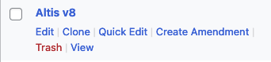
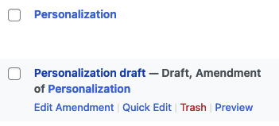
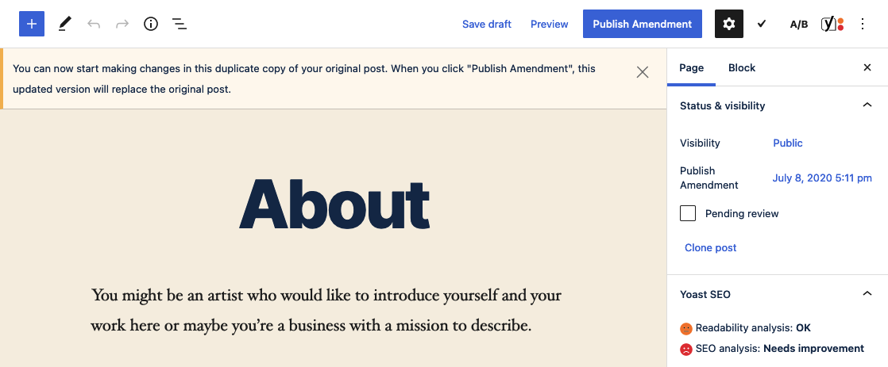
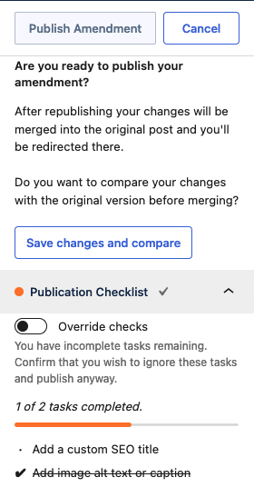
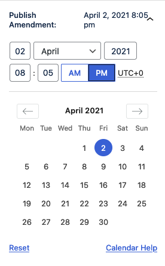
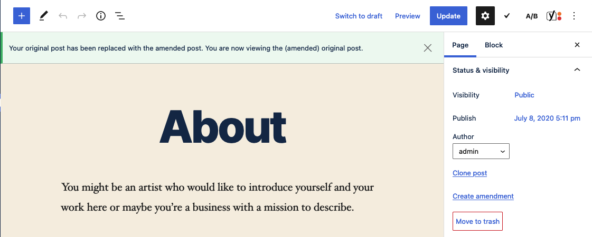
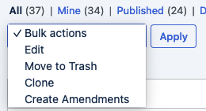
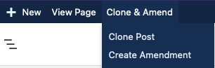

# Clone & Amend

The Clone & Amend feature of Altis, powered by the [Duplicate Post plugin by Yoast](https://yoast.com/wordpress/plugins/duplicate-post/), adds two powerful features that work together to improve your content management workflows.

This feature is enabled by default, but can be disabled by editing the configuration file:

```json
{
	"extra": {
		"altis": {
			"modules": {
				"workflow": {
					"clone-amend": false
				}
			}
		}
	}
}
```



## Post Cloning

This feature adds a link to the post list screen that allows a user to clone a post with its metadata and terms to a new, identical post that can be edited independently of the original. This duplicate post will automatically link back to the original post but this reference can be removed by editing the post and checking the "Delete reference to original item" checkbox in the Duplicate Post panel in the editor.


## Amendments

With the Create Amendment feature, you can edit posts that have been published, save those changes in a draft and schedule or publish those changes to go live whenever you like. Posts that are in a draft status or are themselves an amendment of an existing post cannot be amended. In other words, while you may click Create Amendment to create multiple draft copies of an originating post, you cannot create an Amendment an Amendment.



When you click the link to Create Amendment, a cloned version of that post is created for you to edit. When you have completed your edits and are ready to publish, the content from the updated copy _replaces_ the original post content and the duplicate is deleted. In this way, it is unique from the Clone Post feature which creates a copy but does not replace the original.



When you are ready to publish your changes, clicking Publish Amendment will open a dialog that asks to confirm that you are ready and that your changes will _overwrite_ the existing post content. From here you can choose to continue to publish or save your changes and view the difference between the two posts.



Post amendments can also be scheduled. In the edit post sidebar or under the publication checklist, next to Publish Amendment you can choose the date for your amendment to go live. By default, the original publish date is retained, but you may schedule the post to publish on a future date and, in that case, the amended version will be merged with the original post on that future date.



When you are ready to publish, clicking Publish Amendment and confirming in the Publish dialog will overwrite the original post with your amended version and create a revision in the WordPress revision history.



Under the hood, the original post content is replaced with that of the duplicate, amended post which is then deleted after the content has been merged.

## Bulk Actions and Admin Menu Bar Items

The Duplicate Post plugin adds bulk actions and new WP Admin menu bar actions to the WordPress admin.

Selecting multiple posts from the post list, you can create copies or amendments of each by using the Clone or Create Amendments actions in the Bulk Actions dropdown menu. If either are selected and the Apply button is clicked, duplicate copies (either clones or amendments) will be made of the selected posts.



When you are editing a post, the admin bar will be updated to include a Clone & Amend dropdown. Within this dropdown, you can clone the current post or create an amendment. If you are currently editing a post amendment, the only additional menu item that appears will be to clone the current amended post.



## Enabled Post Types

The post cloning and post amendments features are enabled for all public post types by default. You can modify this behavior by passing the post types you want to enable these features on to the `altis.modules.workflow.clone-amend.post-types` configuration option.

```json
{
	"extra": {
		"altis": {
			"modules": {
				"workflow": {
					"clone-amend": {
						"post-types": [ "page", "product" ]
					}
				}
			}
		}
	}
}
```

The example above enables the Clone & Amend features on the `page` and `product` post types only. In this case, those features would _not_ be available for the `post` post type or other publicly available post types.

## Allowed Roles

By default, the only roles able to use any of the Clone & Amend actions are site Editors and Administrators, but this can be changed in the config.

```json
{
	"extra": {
		"altis": {
			"modules": {
				"workflow": {
					"clone-amend": {
						"roles": [ "author", "editor", "administrator" ]
					}
				}
			}
		}
	}
}
```

In the example above, Authors have been added to the list of allowed roles.

## Excluded Taxonomies

Specific taxonomies can be excluded from posts that are duplicated. This applies to _all_ duplication actions (whether from duplicating an existing published post to update and revise it, or from simply creating a copy of a post). Excluding taxonomies creates a blanket rule to exclude those taxonomies from being copied to duplicate posts at the config level.

```json
{
	"extra": {
		"altis": {
			"modules": {
				"workflow": {
					"clone-amend": {
						"excluded-taxonomies": [ "categories", "tags" ]
					}
				}
			}
		}
	}
}
```

In the above example, Categories and Tags are excluded from cloned posts, meaning that duplicated posts will _not_ retain any terms from either of those taxonomies. By default, no taxonomies are excluded.
## Developer Documentation

### Filters

#### `duplicate_post_excludelist_filter`

Allows you to exclude specific meta fields from duplicated posts. Values passed into the `$meta_excludelist` array can contain wildcards.

Internally in the Duplicate Post plugin, the array is converted into a regular expression string where the `*` character is recognized as wildcard, before being turned back into an array and processed. This means that if you wanted to exclude all meta keys resembling `_my_awesome_meta_*`, you can pass that in and matching keys will be excluded as well (e.g. `_my_awesome_meta_key`, `_my_awesome_meta_value`, `_my_awesome_meta_1`).

**Parameters**

**`$meta_excludelist`** _(array)_ The default exclusion list.

**Example:**
```php
add_filter( 'duplicate_post_excludelist_filter', function( array $meta_excludelist ) {
	// Add all custom fields matching "my_custom_field_" to the excluded array.
	$meta_excludelist[] = 'my_custom_field_*';

	// Exclude a different, specific meta key.
	$meta_excludelist[] = '_another_custom_meta';

	return $meta_excludelist;
} );
```

#### `duplicate_post_meta_keys_filter`

Allows you to retrieve or alter meta fields' keys after excluding meta fields.

**Parameters**

**`$meta_keys`** _(array)_ The meta keys in the original post, minus those that were previously excluded.

**Example:**
```php
add_filter( 'duplicate_post_meta_keys_filter', function( array $meta_keys ) {
    // Add an additional meta key to the array.
    $meta_keys[] = 'my_custom_field3';

    return $meta_keys;
} );
```

#### `duplicate_post_new_post`

Allows you to filter the new post values before a duplicated post is inserted.

**Parameters**

**`$new_post`** _(array)_ New post values.

**`$post`** _(WP_Post)_ Original post object.

**Example:**
```php
add_filter( 'duplicate_post_new_post', function( array $new_post ) {
	$new_post['post_content'] = $new_post['post_content'] . '<p>Additional content added to the post.</p>';

	return $new_post;
} );
```

### Actions

#### `duplicate_post_pre_copy`

Action hook that fires just before cloning a post.

**Parameters**

**`$post`** _(WP_Post)_ The original post object.

**`$status`** _(bool)_ The intended destination status.

**`$parent_id`** _(int)_ The parent post ID if called recursively.

**Example:**
```php
add_action( 'duplicate_post_pre_copy', function( $post ) {
	// Perform an action before copying the post.
	if ( $post->post_type === 'product' ) {
		update_post_meta( $post->ID, 'product_type', 't-shirt' );
	}
} )
```

#### `duplicate_post_post_copy`

Action hook that fires after cloning a post.

**Parameters**

**`$new_post_id`** _(int|WP_Error)_ The new post id or WP_Error object on error.

**`$post`** _(WP_Post)_ The original post object.

**`$status`** _(bool)_ The intended destination status.

**`$parent_id`** _(int)_ The parent post ID if called recursively.

**Example:**
```php
add_action( 'duplicate_post_post_copy', function( $new_post_id, $post ) {
	// Perform an action after copying the post.
	if ( $post->post_type === 'product' ) {
		delete_post( $post->ID, $post );
	}
} )
```
### Functions

#### `duplicate_post_get_original( $post, $output )`

Returns the original post of the requested post/post ID, either as a post object, an associative array or a numeric array.

**Parameters**

**`$post`** _(int|WP_Post|null)_ (optional) Post ID or post object. Defaults to the global `$post`.
**`$output`** _(string)_ (optional) The required return type. One of `OBJECT`, `ARRAY_A` or `ARRAY_N`, which correspond to a `WP_Post` object, an associative array, or a numeric array, respectively. Defaults to `OBJECT`.

**Example:**
```php
$original_post = duplicate_post_get_original( $cloned_post_id, ARRAY_A );
```

For full documentation on available [template tags](https://developer.yoast.com/duplicate-post/functions-template-tags) and [action and filter hooks](https://developer.yoast.com/duplicate-post/filters-actions), go to the [Yoast Duplicate Post developer documentation site](https://developer.yoast.com/duplicate-post/overview).
