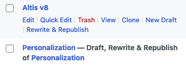
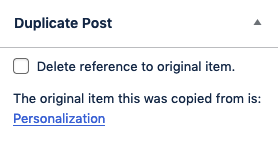

# Clone & Republish

The Clone & Republish feature of Altis, powered by the [Duplicate Post plugin by Yoast](https://yoast.com/wordpress/plugins/duplicate-post/), adds two powerful features that work together to improve your content management workflows.

This feature is enabled by default, but can be disabled by editing the configuration file:

```json
{
	"extra": {
		"altis": {
			"modules": {
				"workflow": {
					"clone-republish": false
				}
			}
		}
	}
}
```



## Post Cloning

This feature adds a link to the post list screen that allows a user to clone a post with its metadata and terms to a new, identical post. This duplicate post will automatically link back to the original post but this reference can be removed by editing the post and checking the "Delete reference to original item" checkbox in the Duplicate Post panel in the editor.



## New Draft

Posts can have multiple concurrent drafts with the New Draft feature. Clicking New Draft will create a new duplicate copy of the original post that can be edited independently of the original. Publishing a post that was created with the New Draft works the same as publishing any other new post, with the exception that the original post will be linked from the New Draft copy in the admin. This reference is functionally the same as the reference in a cloned post.

## Rewrite & Republish

Posts that have been published have the ability to be edited, saved as a draft, revised and republished without affecting the published post with the Rewrite & Republish link. This link does not appear on posts that are drafts or are themselves clones or republished posts. In other words, while you may click Rewrite & Republish to create multiple draft copies of an originating post, you cannot Rewrite & Republish a post that is a copy of that post.

When you click the link to Rewrite & Republish a post, a cloned version of that post is created for you to edit. When you have completed your edits and are ready to publish, the content from the updated copy _replaces_ the original post content and the duplicate is deleted. In this way, it is unique from the Clone and New Draft features which can create a copy but do not replace the original.

## Enabled Post Types

The post cloning, new draft and rewrite & republish features are enabled for all public post types by default. You can modify this behavior by passing the post types you want to enable these features on to the `altis.modules.workflow.clone-republish.post-types` configuration option.

```json
{
	"extra": {
		"altis": {
			"modules": {
				"workflow": {
					"clone-republish": {
						"post-types": [ "page", "product" ]
					}
				}
			}
		}
	}
}
```

The example above enables the Clone & Republish features on the `page` and `product` post types only. In this case, those features would _not_ be available for the `post` post type or other publicly available post types.

## Allowed Roles

By default, the only roles able to use any of the Clone & Republish actions are site Editors and Administrators, but this can be changed in the config.

```json
{
	"extra": {
		"altis": {
			"modules": {
				"workflow": {
					"clone-republish": {
						"roles": [ "author", "editor", "administrator" ]
					}
				}
			}
		}
	}
}
```

In the example above, Authors have been added to the list of allowed roles.

## Excluded Taxonomies

Specific taxonomies can be excluded from posts that are duplicated. This applies to _all_ duplication actions (whether from duplicating an existing published post to update and revise it, or from simply creating a copy of a post). The content or taxonomies that are copied on an individual post level can be modified by using internal Duplicate Post filters (like the [duplicate_post_new_post filter](#duplicate_post_new_post) described below), but a blanket rule to exclude certain taxonomies can be added at the config level.

```json
{
	"extra": {
		"altis": {
			"modules": {
				"workflow": {
					"clone-republish": {
						"excluded-taxonomies": [ "categories", "tags" ]
					}
				}
			}
		}
	}
}
```

In the above example, Categories and Tags are excluded from cloned posts, meaning that duplicated posts will _not_ retain any terms from either of those taxonomies. By default, no taxonomies are excluded.
## Developer Documentation

### Filters

#### `duplicate_post_excludelist_filter`

Allows you to exclude specific meta fields from duplicated posts.

**Parameters**

**`$meta_excludelist` _(array)_ The default exclusion list.

**Example:**
```php
add_filter( 'duplicate_post_excludelist_filter', function( array $meta_excludelist ) {
	// Add custom fields to the defaults array.
	$meta_excludelist[] = 'my_custom_field_1';
	$meta_excludelist[] = 'my_custom_field_2';

	return $meta_excludelist;
} );
```

#### `duplicate_post_meta_keys_filter`

Allows you to retrieve or alter meta fields' keys after excluding meta fields.

**Parameters**

**`$meta_keys`** _(array)_ The meta keys in the original post, minus those that were previously excluded.

**Example:**
```php
add_filter( 'duplicate_post_meta_keys_filter', function( array $meta_keys ) {
    // Add an additional meta key to the array.
    $meta_keys[] = 'my_custom_field3';

    return $meta_keys;
} );
```

#### `duplicate_post_new_post`

Allows you to filter the new post values before a duplicated post is inserted.

**Parameters**

**`$new_post`** _(array)_ New post values.

**`$post`** _(WP_Post)_ Original post object.

**Example:**
```php
add_filter( 'duplicate_post_new_post', function( array $new_post ) {
	$new_post['post_content'] = $new_post['post_content'] . '<p>Additional content added to the post.</p>';

	return $new_post;
} );
```
### Actions

#### `duplicate_post_pre_copy`

Action hook that fires just before cloning a post.

**Parameters**

**`$post`** _(WP_Post)_ The original post object.

**`$status`** _(bool)_ The intended destination status.

**`$parent_id`** _(int)_ The parent post ID if called recursively.

**Example:**
```php
add_action( 'duplicate_post_pre_copy', function( $post ) {
	// Perform an action before copying the post.
	if ( $post->post_type === 'product' ) {
		update_post_meta( $post->ID, 'product_type', 't-shirt' );
	}
} )
```

#### `duplicate_post_post_copy`

Action hook that fires after cloning a post.

**Parameters**

**`$new_post_id`** _(int|WP_Error)_ The new post id or WP_Error object on error.

**`$post`** _(WP_Post)_ The original post object.

**`$status`** _(bool)_ The intended destination status.

**`$parent_id`** _(int)_ The parent post ID if called recursively.

**Example:**
```php
add_action( 'duplicate_post_post_copy', function( $new_post_id, $post ) {
	// Perform an action after copying the post.
	if ( $post->post_type === 'product' ) {
		delete_post( $post->ID, $post );
	}
} )
```
### Functions

#### `duplicate_post_get_original( $post, $output )`

Returns the original post of the requested post/post ID, either as a post object, an associative array or a numeric array.

**Parameters**

**`$post`** _(int|WP_Post|null)_ (optional) Post ID or post object. Defaults to the global `$post`.
**`$output`** _(string)_ (optional) The required return type. One of `OBJECT`, `ARRAY_A` or `ARRAY_N`, which correspond to a `WP_Post` object, an associative array, or a numeric array, respectively. Defaults to `OBJECT`.

**Example:**
```php
$original_post = duplicate_post_get_original( $cloned_post_id, ARRAY_A );
``

For full documentation on available [template tags](https://developer.yoast.com/duplicate-post/functions-template-tags) and [action and filter hooks](https://developer.yoast.com/duplicate-post/filters-actions), go to the [Yoast Duplicate Post developer documentation site](https://developer.yoast.com/duplicate-post/overview).
